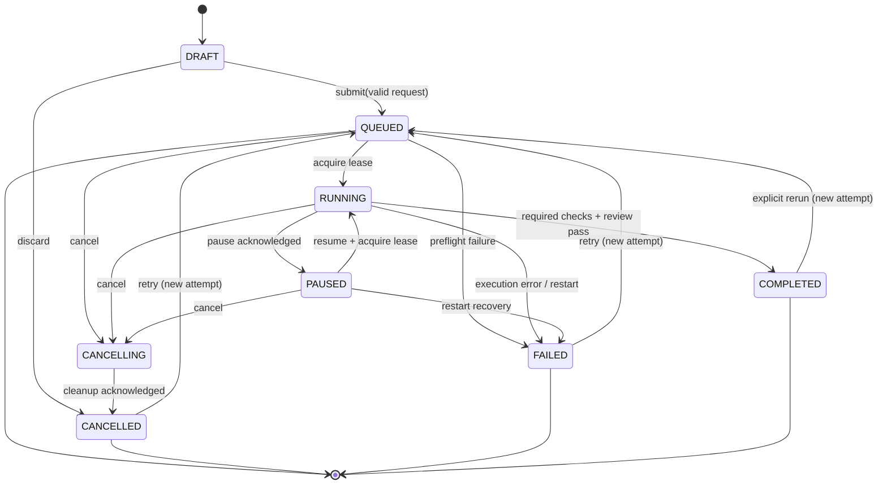

# Agent Hub task state machine

**Scope:** durable, user-visible execution state for one Agent Hub pipeline. A state belongs to a task ID, not to the foreground service, fragment, or a Python worker thread.

## States and invariants

| State | Entry condition | Exit condition | Invariant |
|---|---|---|---|
| `DRAFT` | UI has an unsaved request, or validation has not yet created a task ID. | Request is submitted or discarded. | No durable run record; no worker is scheduled. |
| `QUEUED` | A validated request and immutable task ID are accepted. | Worker lease is acquired, cancellation is requested, or preflight fails. | Run is durable and has no active worker lease. |
| `RUNNING` | Exactly one worker atomically acquires the lease for a queued/retried run. | Pause, cancellation, success, or a terminal error. | A current stage and lease owner are present; progress may advance but never decrease. |
| `PAUSED` | A running worker acknowledges pause at a safe checkpoint. | Resume, cancellation, or restart recovery. | No model call, file write, or test process may start while paused. |
| `CANCELLING` | Cancellation is accepted for a queued, running, or paused run. | All subprocesses/model calls are stopped and cleanup completes. | New stage work and retries are forbidden; cancellation is idempotent. |
| `CANCELLED` | Cancellation cleanup succeeds, including subprocess termination. | Retry creates a new attempt and queues it. | Terminal for the attempt; result is never reported as successful. |
| `FAILED` | Validation, provider, workspace, test, process-restart, or unexpected execution error is recorded. | Retry creates a new attempt and queues it. | Terminal for the attempt; structured failure code and sanitized diagnostic are retained. |
| `COMPLETED` | Mandatory verification and final review policy succeed. | Retry/re-run explicitly creates a new attempt and queues it. | Terminal for the attempt; `completedAt` and immutable result summary are present. |

A retry never changes a terminal attempt back to `RUNNING`: it creates a new `attemptNo` for the same logical task. The current implementation uses string statuses and may mark process recovery as `interrupted`; version 2 normalizes that condition to `FAILED` with code `PROCESS_RESTARTED`.

## FSM

## Valid transitions

The labels below are part of the transition contract; each mutation also appends an audit event.

| # | From | To | Trigger / guard |
|---:|---|---|---|
| 1 | `DRAFT` | `QUEUED` | Request is nonblank, project is valid, task ID is newly allocated. |
| 2 | `DRAFT` | `CANCELLED` | User discards the draft before submission. |
| 3 | `QUEUED` | `RUNNING` | One worker wins the atomic lease claim. |
| 4 | `QUEUED` | `CANCELLING` | User/system requests cancellation. |
| 5 | `QUEUED` | `FAILED` | Preflight/provider/workspace validation fails. |
| 6 | `QUEUED` | `QUEUED` | Queue reconciliation updates position without changing attempt. |
| 7 | `RUNNING` | `RUNNING` | A stage/progress/checkpoint update is committed. |
| 8 | `RUNNING` | `PAUSED` | Worker reaches a safe checkpoint and acknowledges pause. |
| 9 | `RUNNING` | `CANCELLING` | Cancellation request is accepted. |
| 10 | `RUNNING` | `FAILED` | A handled execution error, timeout, or process recovery occurs. |
| 11 | `RUNNING` | `COMPLETED` | Required tests and review policy pass. |
| 12 | `PAUSED` | `PAUSED` | Pause heartbeat or display-only update occurs. |
| 13 | `PAUSED` | `RUNNING` | Resume is requested and a worker reacquires the lease. |
| 14 | `PAUSED` | `CANCELLING` | Cancellation request is accepted. |
| 15 | `PAUSED` | `FAILED` | App/process restart means safe resume cannot be proved. |
| 16 | `CANCELLING` | `CANCELLING` | Cleanup retries subprocess/model-call termination. |
| 17 | `CANCELLING` | `CANCELLED` | Cleanup acknowledgement is persisted. |
| 18 | `CANCELLED` | `QUEUED` | User retries; a new attempt is created. |
| 19 | `FAILED` | `QUEUED` | User retries after required input/configuration is corrected. |
| 20 | `COMPLETED` | `QUEUED` | User explicitly reruns; a new attempt is created. |
| 21 | `FAILED` | `FAILED` | Diagnostic enrichment is appended without clearing the terminal state. |
| 22 | `COMPLETED` | `COMPLETED` | Result/artifact verification metadata is appended only. |

## Invalid transitions deliberately pruned

| # | Pruned path | Why it is forbidden |
|---:|---|---|
| 1 | `DRAFT → RUNNING` | Bypasses validation, durable identity, and queue admission. |
| 2 | `DRAFT → COMPLETED` | No execution or verification occurred. |
| 3 | `QUEUED → PAUSED` | Pause requires a worker checkpoint; cancel instead. |
| 4 | `QUEUED → COMPLETED` | Cannot claim success without work and verification. |
| 5 | `QUEUED → CANCELLED` | Must pass through `CANCELLING` so cleanup is auditable. |
| 6 | `RUNNING → QUEUED` | Would duplicate work and invalidate its lease. |
| 7 | `RUNNING → CANCELLED` | Cannot skip cancellation cleanup. |
| 8 | `RUNNING → DRAFT` | Submitted input and audit history are immutable. |
| 9 | `PAUSED → COMPLETED` | A paused task has not completed required work. |
| 10 | `PAUSED → QUEUED` | Would lose the worker/lease recovery decision. |
| 11 | `CANCELLING → RUNNING` | Cancellation is a one-way safety boundary. |
| 12 | `CANCELLING → COMPLETED` | Completion after a cancellation request is misleading. |
| 13 | `CANCELLED → RUNNING` | Retry must create a new queued attempt first. |
| 14 | `CANCELLED → COMPLETED` | Cancelled work cannot later be presented as success. |
| 15 | `FAILED → RUNNING` | Retry must record a new attempt and re-run preflight. |
| 16 | `FAILED → COMPLETED` | A failure cannot be overwritten by a display update. |
| 17 | `COMPLETED → RUNNING` | Rerun must produce a new attempt and audit trail. |
| 18 | `COMPLETED → FAILED` | Post-completion checks may add findings, not rewrite the attempt outcome. |

## Enforcement points

- The repository—not `EveViewModel`, `EveEventBus`, or the UI—is the state-transition authority.
- Commands include `expectedVersion`; an update succeeds only when task ID, attempt number, current state, and version match.
- Event delivery is at-least-once. Event insertion uses a unique `(runId, sequenceNo)` key so replay cannot duplicate history.
- On process start, expired `RUNNING`, `PAUSED`, and `CANCELLING` leases are reconciled to `FAILED/PROCESS_RESTARTED` unless a verified worker can safely resume them.
- A terminal result is persisted only after output redaction and policy verification.
